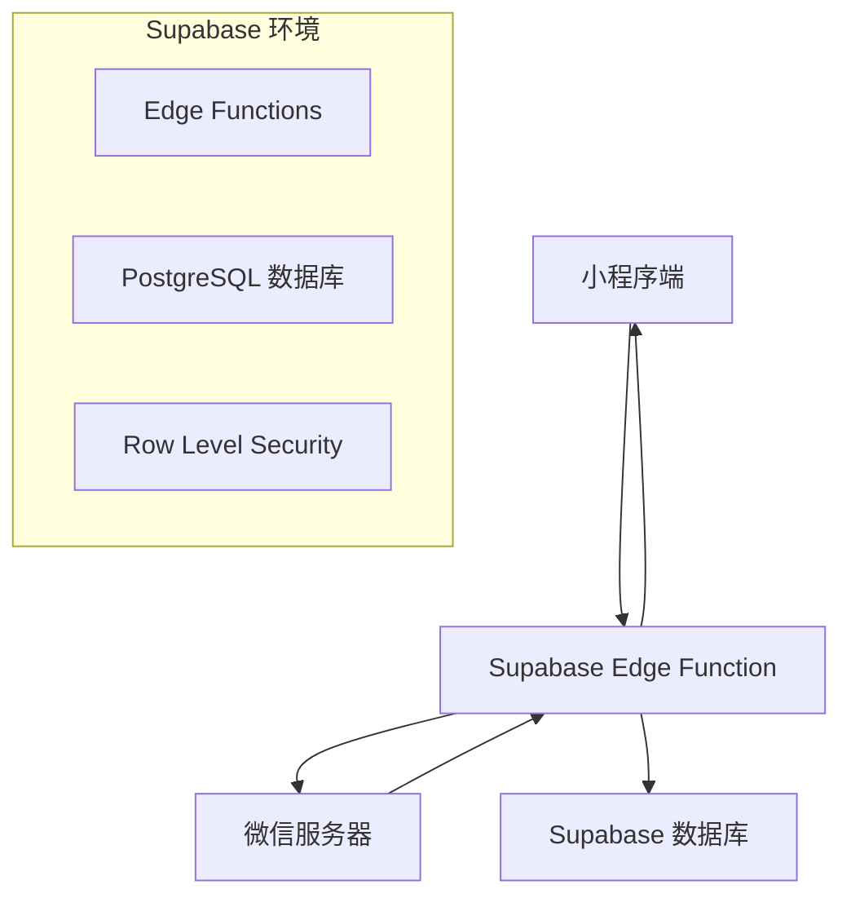

# 🚀 Supabase 微信登录部署指南

## 📋 架构概览



## 🛠️ 第一步：配置 Supabase

### 1.1 环境变量配置

在 Supabase Dashboard → Settings → Edge Functions 中添加环境变量：

```bash
# 微信小程序配置
WECHAT_APP_ID=your_mini_program_appid
WECHAT_APP_SECRET=your_mini_program_appsecret

# JWT 配置
JWT_SECRET=your_jwt_secret_key_for_token_signing

# Supabase 配置（自动添加）
SUPABASE_URL=https://your-project.supabase.co
SUPABASE_ANON_KEY=your_supabase_anon_key
SUPABASE_SERVICE_ROLE_KEY=your_service_role_key
```

### 1.2 数据库表创建

执行 `supabase/migrations/wechat_login_tables.sql` 文件：

```sql
-- 方法1: 通过 Supabase Dashboard
-- 打开 SQL Editor，粘贴并执行该文件内容

-- 方法2: 通过 CLI
supabase db push
```

### 1.3 创建 Edge Function

部署微信登录 Edge Function：

```bash
# 方法1: 通过 Supabase CLI
supabase functions deploy wechat-login

# 方法2: 通过 Dashboard
# 在 Edge Functions 页面上传代码
```

## 🔧 第二步：小程序端配置

### 2.1 更新 Supabase 配置

确保 `utils/supabase.js` 中的配置正确：

```javascript
const supabaseUrl = 'https://your-project.supabase.co'
const supabaseAnonKey = 'your_supabase_anon_key'
```

### 2.2 微信登录工具（已更新）

`utils/wechat-login.js` 已经适配 Supabase 架构：

```javascript
// 核心流程
async login() {
  const code = await this.getWxLoginCode()           // 1. 获取 code
  const result = await this.sendCodeToServer(code)      // 2. 调用 Edge Function
  this.saveLoginToken(result.token, result.userInfo)    // 3. 保存 token
}
```

### 2.3 数据库操作

使用 Supabase 进行用户数据管理：

```javascript
// 保存用户信息
await supabase
  .from('users')
  .upsert({
    openid: userInfo.openid,
    name: userInfo.name,
    // ... 其他字段
  }, {
    onConflict: 'openid'
  })

// 查询用户信息
const { data } = await supabase
  .from('users')
  .select('*')
  .eq('openid', openid)
  .single()
```

## 🛡️ 第三步：安全配置

### 3.1 Row Level Security (RLS)

数据库已配置 RLS 策略：

```sql
-- 用户只能查看自己的信息
CREATE POLICY "Users can view their own profile" ON users
  FOR SELECT USING (auth.uid()::text = openid::text);

-- 用户只能更新自己的信息
CREATE POLICY "Users can update their own profile" ON users
  FOR UPDATE USING (auth.uid()::text = openid::text);
```

### 3.2 会话管理

Edge Function 处理会话生命周期：

```typescript
// 创建会话
const sessionData = {
  user_id: userInfo.id,
  openid: openid,
  session_key: session_key,
  token: customToken,
  expires_at: new Date(Date.now() + 30 * 24 * 60 * 60 * 1000)
}

// 保存到数据库
await supabase
  .from('user_sessions')
  .insert(sessionData)
```

### 3.3 JWT Token 验证

在 Edge Function 中验证 token：

```typescript
// 生成自定义 token
function generateCustomToken(openid: string, sessionKey: string) {
  const payload = {
    openid,
    iat: Math.floor(Date.now() / 1000),
    exp: Math.floor(Date.now() / 1000) + (30 * 24 * 60 * 60)
  }
  
  return `token_${openid}_${Date.now()}_${random}`
}
```

## 📱 第四步：测试和验证

### 4.1 Edge Function 测试

```bash
# 测试 Edge Function
curl -X POST "https://your-project.supabase.co/functions/v1/wechat-login" \
  -H "Authorization: Bearer your_anon_key" \
  -H "Content-Type: application/json" \
  -d '{"code": "test_code"}'
```

### 4.2 小程序测试

在开发者工具中测试：

```javascript
// 测试微信登录
const { wechatLogin } = require('../../utils/wechat-login')

async function testLogin() {
  try {
    const result = await wechatLogin.login()
    console.log('登录结果:', result)
    
    if (result.success) {
      console.log('Token:', result.token)
      console.log('用户信息:', result.userInfo)
    }
  } catch (error) {
    console.error('登录失败:', error)
  }
}
```

### 4.3 数据库验证

```sql
-- 查看用户记录
SELECT * FROM users WHERE openid = 'test_openid';

-- 查看会话记录
SELECT * FROM user_sessions WHERE openid = 'test_openid';

-- 查看登录日志
SELECT * FROM login_logs WHERE openid = 'test_openid' ORDER BY login_time DESC;
```

## 🔍 第五步：监控和维护

### 5.1 Edge Function 监控

在 Supabase Dashboard 查看：

- Function 调用次数
- 执行时间
- 错误日志
- 资源使用情况

### 5.2 数据库监控

关键指标：

```sql
-- 活跃用户统计
SELECT 
  COUNT(*) as total_users,
  COUNT(CASE WHEN last_login_time > NOW() - INTERVAL '7 days' THEN 1 END) as active_users,
  COUNT(CASE WHEN created_at > NOW() - INTERVAL '30 days' THEN 1 END) as new_users
FROM users;

-- 登录成功率
SELECT 
  COUNT(*) as total_logins,
  COUNT(CASE WHEN login_result = 'success' THEN 1 END) as successful_logins,
  ROUND(COUNT(CASE WHEN login_result = 'success' THEN 1 END) * 100.0 / COUNT(*), 2) as success_rate
FROM login_logs 
WHERE login_time > NOW() - INTERVAL '1 day';
```

### 5.3 性能优化

Edge Function 优化建议：

```typescript
// 使用连接池
const supabase = createClient(
  SUPABASE_URL,
  SUPABASE_SERVICE_ROLE_KEY,
  {
    db: {
      poolSize: 10,
      connectionTimeoutMillis: 10000
    }
  }
)

// 缓存微信配置
const wechatConfig = {
  appId: Deno.env.get('WECHAT_APP_ID'),
  appSecret: Deno.env.get('WECHAT_APP_SECRET')
}
```

## 🚨 故障排除

### 常见问题和解决方案

#### 1. Edge Function 部署失败
**问题**: 部署时出现编译错误
**解决**: 检查 TypeScript 语法和依赖

```bash
# 本地测试
supabase functions serve --no-verify-jwt

# 查看详细日志
supabase functions logs wechat-login
```

#### 2. 微信 API 调用失败
**问题**: 向微信服务器请求失败
**解决**: 检查 AppID 和 AppSecret

```typescript
// 验证配置
console.log('微信配置:', {
  appId: WECHAT_CONFIG.appId,
  appSecret: WECHAT_CONFIG.appSecret ? '已设置' : '未设置'
})
```

#### 3. 数据库连接错误
**问题**: Edge Function 无法连接数据库
**解决**: 检查环境变量和权限

```sql
-- 检查 RLS 策略
SELECT schemaname, tablename, rowsecurity 
FROM pg_tables 
WHERE schemaname = 'public';
```

#### 4. Token 验证失败
**问题**: 小程序端 token 无效
**解决**: 检查 token 生成和验证逻辑

```javascript
// 调试 token
console.log('生成的 token:', customToken)
console.log('Token 有效期:', 30, '天')
```

## 📋 部署清单

### ✅ Supabase 配置
- [ ] 环境变量已设置
- [ ] 数据库表已创建
- [ ] RLS 策略已配置
- [ ] Edge Function 已部署

### ✅ 小程序配置
- [ ] Supabase URL 和 Key 已配置
- [ ] 微信登录服务已集成
- [ ] 错误处理已完善
- [ ] 用户体验已优化

### ✅ 测试验证
- [ ] Edge Function 正常响应
- [ ] 微信登录流程完整
- [ ] 数据库数据正确保存
- [ ] 安全策略生效

### ✅ 监控就绪
- [ ] 日志记录已启用
- [ ] 性能监控已配置
- [ ] 错误报警已设置
- [ ] 备份策略已制定

## 🎉 完成效果

部署完成后，你将获得：

- ✅ **安全的微信登录**：符合微信官方安全标准
- ✅ **完整的用户管理**：用户信息、会话、权限
- ✅ **可扩展的架构**：支持后续功能扩展
- ✅ **详细的监控**：完整的日志和监控体系
- ✅ **高性能**：Edge Function + 数据库优化

---

**🚀 按照这个指南部署，你将拥有一个完整的基于 Supabase 的微信登录系统！**