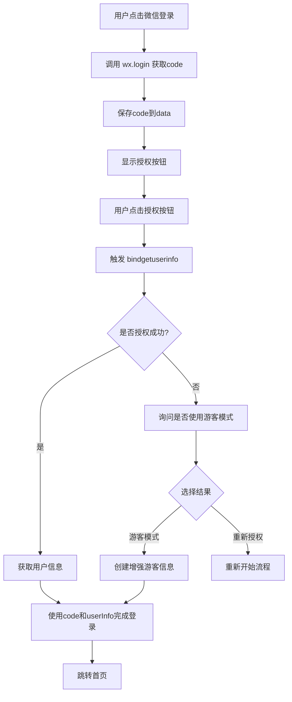

# 🔧 微信登录 API 更新说明

## 📅 更新背景

微信小程序在 **2021年4月13日** 后对获取用户信息的API进行了重大调整：

### ❌ 被限制的API
- `wx.getUserInfo()` - 只能获取匿名数据
- `wx.getUserProfile()` - 受到严格限制

### ✅ 推荐的API
- `open-type="getUserInfo"` - 通过按钮组件获取用户信息

## 🚀 新的登录流程

### 1. 修改按钮组件
```xml
<!-- 旧的方式（已失效） -->
<button bindtap="handleWechatLogin">微信登录</button>

<!-- 新的方式（推荐） -->
<button 
  open-type="getUserInfo"
  bindgetuserinfo="handleGetUserInfo"
>
  微信授权登录
</button>
```

### 2. 优化的登录逻辑
```javascript
// 步骤1: 获取 wx.login code
wx.login({
  success: (res) => {
    this.setData({ wechatCode: res.code })
  }
})

// 步骤2: 用户点击授权按钮，触发 bindgetuserinfo
handleGetUserInfo(e) {
  const userInfo = e.detail.userInfo
  // 使用 userInfo 和保存的 code 完成登录
}
```

## 🎯 修复的关键问题

### 问题1: 无法获取用户头像和昵称
**原因**: 使用了被限制的 `wx.getUserProfile` API
**解决**: 改用 `open-type="getUserInfo"` 方式

### 问题2: 真机调试显示游客模式
**原因**: API调用失败后自动fallback到游客模式
**解决**: 使用微信推荐的方式，提高成功率

### 问题3: 用户体验差
**原因**: 复杂的多重尝试逻辑
**解决**: 简化为标准的两步流程

## 📱 新的登录流程图



## 🔍 调试信息

### 关键日志输出
```javascript
console.log('wx.login 成功，code:', code)
console.log('获取用户信息:', userInfo)
console.log('登录类型:', hasRealInfo ? '真实用户' : '游客模式')
```

### 数据结构
```javascript
userData = {
  id: timestamp,
  openid: `wx_${code.substring(0, 10)}_${timestamp}`,
  name: userInfo.nickName,     // 真实微信昵称
  avatar: userInfo.avatarUrl,  // 真实微信头像
  loginType: 'wechat',
  hasRealInfo: true/false,     // 是否真实用户
  platform: 'android/ios/devtools'
}
```

## ⚠️ 注意事项

### 1. 真机测试
- 必须在真机上测试授权流程
- 开发工具可能表现不同
- 注意网络环境对API调用的影响

### 2. 权限配置
确保小程序配置文件中包含必要的权限：
```json
{
  "permission": {
    "scope.userInfo": {
      "desc": "您的微信信息将用于完善会员资料"
    }
  }
}
```

### 3. 错误处理
- 用户拒绝授权：提供游客模式选项
- 网络异常：提示用户重试
- API限制：优雅降级

## 🎉 预期效果

### 用户体验
- ✅ 一键授权：点击即可完成登录
- ✅ 真实信息：正确获取微信头像和昵称
- ✅ 优雅降级：拒绝授权也有好的体验

### 技术稳定性
- ✅ 兼容性好：支持所有微信小程序版本
- ✅ 成功率高：使用推荐API，降低失败率
- ✅ 易维护：简化的逻辑，便于后续维护

## 📋 测试清单

### ✅ 必测场景
- [ ] 正常授权登录
- [ ] 拒绝授权后选择游客模式
- [ ] 拒绝授权后重新授权
- [ ] 网络异常情况
- [ ] 不同机型测试
- [ ] 不同微信版本测试

### 🔍 验证点
- [ ] 用户头像正确显示
- [ ] 用户昵称正确获取
- [ ] 登录状态正常保存
- [ ] 首页信息正确展示
- [ ] 数据库记录正确

---

**更新时间**: 2024年
**API版本**: 微信小程序最新版本
**兼容性**: 全平台支持