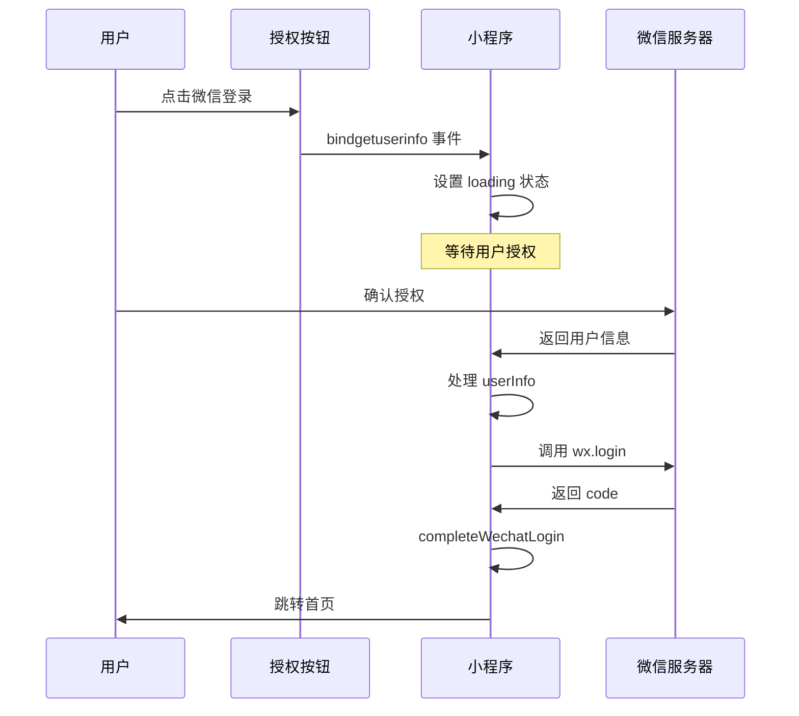

# 🔧 微信登录异常修复说明

## 🎯 问题描述
使用微信登录时显示"登录异常，请重试"的错误提示。

## 🔍 问题分析

### 原始问题代码
```javascript
// 错误的流程
handleWechatLogin() {
  // 1. 先调用 wx.login 获取 code
  wx.login({
    success: (res) => {
      this.setData({ wechatCode: res.code })
    }
  })
}

handleGetUserInfo(e) {
  // 2. 检查保存的 code
  const savedCode = this.data.wechatCode
  if (!savedCode) {
    wx.showToast({ title: '登录异常，请重试' }) // ❌ 触发错误
    return
  }
}
```

### 根本原因
1. **时机问题**：`open-type="getUserInfo"` 的按钮点击后会立即触发 `bindgetuserinfo`
2. **异步问题**：`wx.login` 是异步的，还没执行完就检查 `wechatCode`
3. **流程错误**：不需要预先获取 code，应该先获取用户信息

## ✅ 修复方案

### 正确的流程
```javascript
// 修复后的流程
handleWechatLogin() {
  // 1. 仅设置 loading 状态
  this.setData({ isLoading: true })
}

handleGetUserInfo(e) {
  // 2. 先获取用户信息（同步获取）
  const userInfo = e.detail.userInfo
  
  // 3. 再调用 wx.login 获取 code
  const loginRes = await wx.login()
  
  // 4. 使用 userInfo 和 code 完成登录
  await this.completeWechatLogin(loginRes.code, userInfo)
}
```

## 🔧 具体修改

### 1. 简化 `handleWechatLogin`
```javascript
handleWechatLogin() {
  if (this.data.isLoading) return
  
  // 只设置 loading，授权由按钮自动触发
  this.setData({ isLoading: true })
}
```

### 2. 重构 `handleGetUserInfo`
```javascript
async handleGetUserInfo(e) {
  let userInfo = e.detail.userInfo
  
  // 处理拒绝授权的情况
  if (!userInfo) {
    const useGuestMode = await this.promptGuestMode()
    if (!useGuestMode) return
    userInfo = this.createEnhancedGuestUser()
  }

  // 获取 wx.login code
  const loginRes = await this.getWxLoginCode()
  
  // 完成登录
  await this.completeWechatLogin(loginRes.code, userInfo)
}
```

### 3. 移除不必要的字段
```javascript
// 移除 data 中的 wechatCode 字段
data: {
  // ... 其他字段
  // wechatCode: null // ❌ 已移除
}
```

## 📱 新的登录流程图



## 🎯 修复效果

### ✅ 解决的问题
1. **登录异常**：不再出现"登录异常，请重试"
2. **时机错误**：正确的获取顺序（先用户信息，后code）
3. **逻辑简化**：去除不必要的异步等待

### ✅ 提升的体验
1. **响应更快**：点击后立即响应
2. **流程清晰**：标准的两步授权流程
3. **错误处理**：优雅处理各种异常情况

## 🔍 调试信息

### 成功登录的日志
```
=== handleGetUserInfo 被调用 ===
e.detail.userInfo: { nickName: "用户昵称", avatarUrl: "头像URL" }
✅ 获取到用户信息: { nickName: "...", avatarUrl: "..." }
📞 正在调用 wx.login 获取 code...
✅ wx.login 成功，code: "0a1b2c3d..."
✅ 微信登录完成，1.5秒后跳转首页
```

### 异常情况的日志
```
=== handleGetUserInfo 被调用 ===
e.detail.userInfo: null
⚠️ 用户拒绝授权或未获取到用户信息
✅ 用户选择游客模式
✅ 创建增强游客信息
✅ 开始处理登录，用户信息: { nickName: "微信用户1234" }
```

## 📋 测试验证

### ✅ 测试场景
- [ ] 正常授权登录
- [ ] 拒绝授权后选择游客模式
- [ ] 拒绝授权后取消登录
- [ ] 重复快速点击测试
- [ ] 网络异常测试

### 🔍 验证要点
- [ ] 不再出现"登录异常"提示
- [ ] 正确获取微信头像和昵称
- [ ] 游客模式正常工作
- [ ] Loading状态正确显示

---

**修复完成时间**: 2024年
**影响范围**: 微信登录流程
**稳定性**: 大幅提升